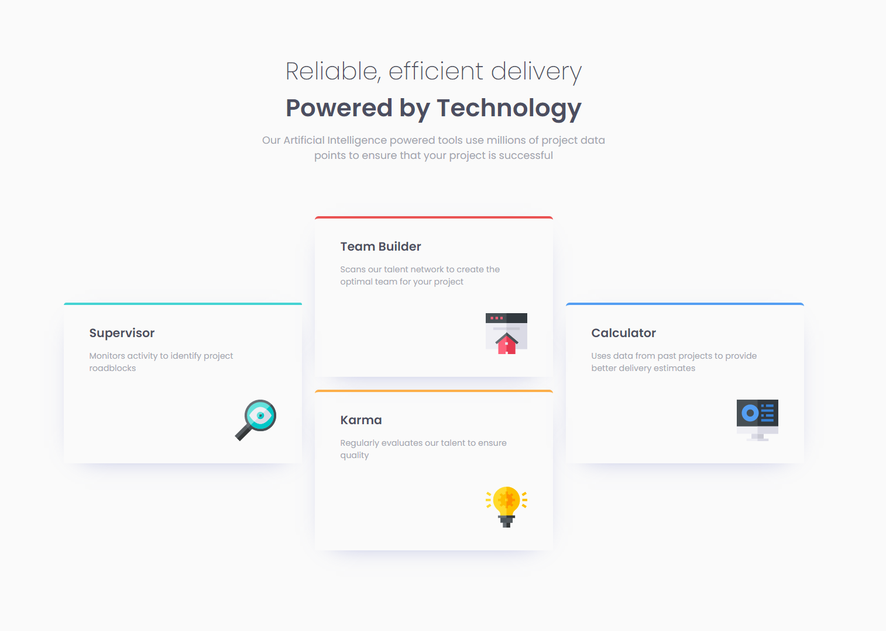

# Frontend Mentor - Four card feature section solution

This is a solution to the [Four card feature section challenge on Frontend Mentor](https://www.frontendmentor.io/challenges/four-card-feature-section-weK1eFYK). Frontend Mentor challenges help you improve your coding skills by building realistic projects. 

## Table of contents

- [Overview](#overview)
  - [The challenge](#the-challenge)
  - [Screenshot](#screenshot)
- [My process](#my-process)
  - [Built with](#built-with)
  - [Links](#Links)
  - [What I learned](#what-i-learned)
  - [Continued development](#continued-development)
- [Author](#author)

## Overview

### The challenge

Users should be able to:

- View the optimal layout depending on their device's screen size (Desktop, Ipad and mobile)

### Screenshot

  

  

## My process

### Built with

- Semantic HTML5 markup
- CSS custom properties
- Flexbox
- CSS Grid
- Mobile-first workflow

### Links

- Solution URL: [Github Repository](https://github.com/m-Ash1/four-card-feature-section)
- Live Site URL: [Github Pages](https://m-ash1.github.io/four-card-feature-section/)

### What I learned

This challenge sharpen my skills in Grid and positioning of the element on it and it is a good practice on responsive designs

### Continued development

I will practice more on using grid and using the 12s coulumn way to arrange the website

## Author

- Behance - [Mahmoud Ashraf](https://www.behance.net/m_ashraffarouk/)
- Frontend Mentor - [@m-Ash1](https://www.frontendmentor.io/profile/m-Ash1)
- Twitter - [@m_ashraffarouk](https://www.twitter.com/m_ashraffarouk)